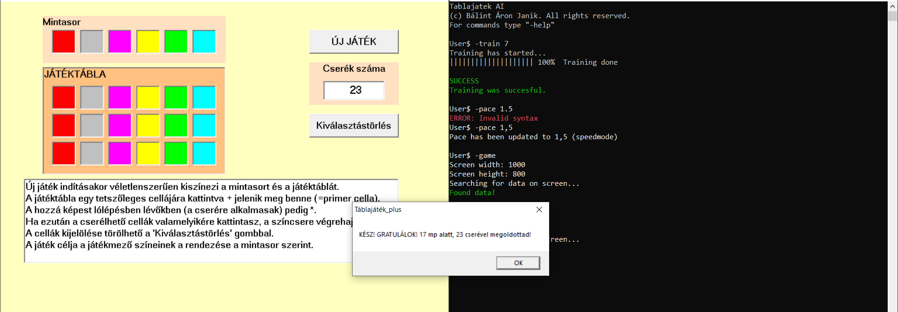

# Boardgame solver

## About
This is an OLD project of mine, which does not follow any clean code principles at all, and does not provide the optimal solution for the boardgame. I uploaded this project, to show how I solved relatively complex problems with the limited tools and knowledge I had at the time.

## The game
The game follows really simple rules. A total of 6 different colors are shown in 6 boxes in a random order. The player has a 6x3 table, and every one of the 6 colors appear exactly 3 times in the table. The user can switch the color of 2 fields by clicking on them. However, the switch cannot be between any 2 fields! If you click on a field, you can only switch with those, that are two squares horizontally and one square vertically away (so called "Knight's move" in chess terms) from it. The goal is to match every row of the table to the "sample row" visible at the top, obviously with the least steps and time possible.
The game was made in Visual Basic by my grandfather a while ago.

## The software
My software first needs to be trained. It is trained on hard-coded data, to be able to step to any field from any other field in the table with as few steps as possible. So basically it learns the "Knight's move". Then, the user can start a solve. The game must be visible on the screen, as the program checks the screen output, and reconstructs the sample row and the gametable as arrays. Then it manipulates cursor movements and mouse clicks to perform the switches. If everything goes well, the program solves the game. The user can also specify pace, view statistics, etc.

## My insights
While it was a fun project, and I like that it works, as of today I would approach the problem differently. First of all, I would not call it AI, as the solve itself is algorithmic, only the Knight's move is learned. I would approach this problem with decision trees probably. Moreover, a software of this scale should be planned ahead, with more abstract components and only implemented afterwards.